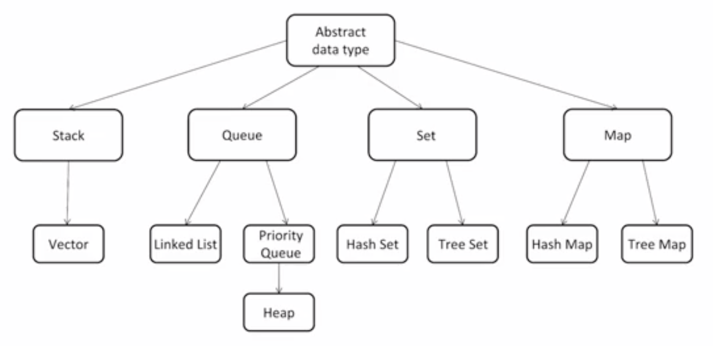

## 如何事半功倍地学习算法与数据结构
《Outlier》（异类——不一样的成功启示录）里面提到，**精通一个领域**：
- **Chunk it up（切碎知识点）**
  - 如下图
- **Deliberate practicing（刻意练习）**
  - 坚持、刻意练习
  - 练习缺陷、弱点地方
  - 不舒服、不爽、枯燥
  - 生活中例子：乒乓球、台球、游戏等等
- **Feedback（反馈）**
  - 即时反馈
  - 主动型反馈（自己去找）
    - 高手代码（Github、Leetcode等）
    - 第一视角直播
  - 被动型反馈（高手给你指点）
    - code review
    - 教练看你打，给你反馈

### 切题四件套
- Clarification 弄清楚题意
- Possible solutions 把相关解法都写出来
  - compare(time/space)
  - optimal(加强)
- Coding 多写
- Test cases 多写测试用例

## 如何计算算法的复杂度
- 时间复杂度
  - 二分查找：O(log n)
  - 二叉树遍历：O(n)
  - Optimal sorted matrix search：O(n)
  - 归并排序：O(n * log n)
- 空间复杂度

## 如何通过LeetCode来进行算法题目练习
做题四件套，时刻考虑时间复杂度。

## 数组&链表

### 数组
- Access: O(1)
- Insert: 平均O(n)
- Delete: 平均O(n)

### 链表
为什么要引入链表？
- 数组对于**插入、删除操作效率**比较慢；
- 当**不知道元素个数**时，用数组不合适。

复杂度：
- Space: O(n)
- Prepend: O(1)
- Append: O(1)
- Looup: O(n)
- Insert: O(1)
- Delete: O(1)

## 反转一个单链表&判断链表是否有环
- https://leetcode.com/problems/reverse-linked-list
- https://leetcode.com/problems/swap-nodes-in-pairs
- https://leetcode.com/problems/linked-list-cycle
- https://leetcode.com/problems/linked-list-cycle-ii
- https://leetcode.com/problems/reverse-nodes-in-k-group

### 反转一个单链表
