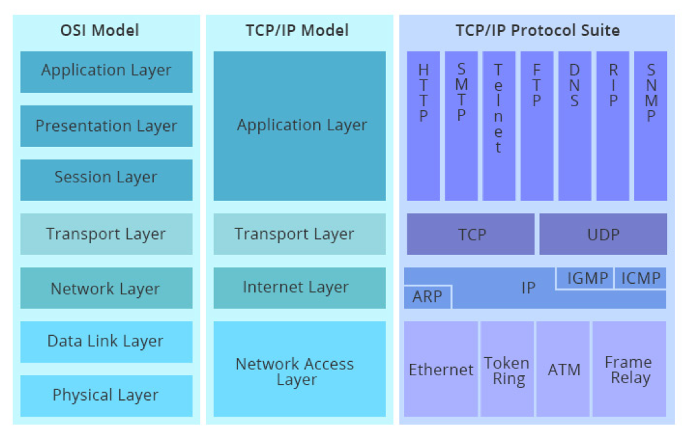
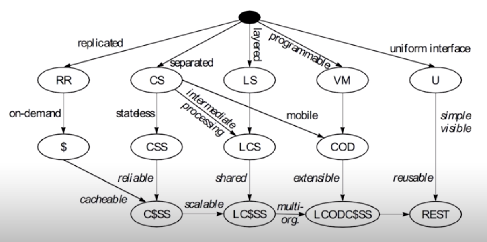

## OSI模型与TCP/IP模型
OSI概念模型：

OSI概念模型与TCP/IP模型对照：

## 评估Web架构的七大关键属性
HTTP协议应当在七大属性中取得可接受的平衡：

1. **性能Performance**：影响高可用的关键因素。
2. **可伸缩性Scalability**：支持部署可以互相交互的大量组件。
3. **简单性Simplicity**：易理解、易实现、易验证。
4. **可见性Visiable**：对两个组件间的交互进行监视或者仲裁的能力。如缓存、分层设计等。
5. **可移植性Portability**：在不同的环境下运行的能力。
6. **可靠性Reliability**：出现部分故障时，对整体影响的程度。
7. **可修改性Modifiability**：对系统作出修改的难易程度，由可进化性、可定制性、可扩展性、可配置性、可重用性构成。

## 从五种架构风格推导出HTTP的REST架构

### 1 数据流风格Data-flow Styles
优点：简单性、可进化性、可扩展性、可配置性、可重用性。

- **管道与过滤器**Pipe and Filter，PF：每个Filter都有输入端和输出端，只能从输入端读取数据，处理后再从输出端产生数据。
- **统一接口的管道与过滤器**Uniform Pipe and Filter，UPF：在PF上增加了统一接口的约束，所以Filter过滤器必须具备同样的接口。

### 2 复制风格Replication Styles 
优点：用户可察觉的性能、可伸缩性，网络效率、可靠性也可以提到提升。

- **复制仓库**Replicated Repository，RR：多个进程提供相同的服务，通过反向代理对外提供集中服务。
- **缓存**：RR的变体，通过复制请求的结果，为后续请求复用。

### 3 分层风格Hierarchical Styles 
优点：简单性、可进化性、可伸缩性。

- **客户端服务器**Client-Server，CS
  - 由Client触发请求，Server监听到请求后产生响应，Client一直等待收到响应后，会话结束。
  - 分离关注点隐藏细节，良好的简单性、可伸缩性、可进化性。
- **分层系统**Layered System，LS：每一层为其之上的层服务，并使用在其之下的层所提供的服务，例如TCP/IP。
- **分层客户端服务器**Layered Client-Server，LCS：例如正向代理和反向代理。
- **无状态、客户端服务器**Client-Stateless-Server，CSS
  - 基于CS，服务器上不允许有session state会话状态。
  - 提升了可见性、可伸缩性、可靠性，但重复数据导致降低网络性能。
- **缓存、无状态、客户端服务器**Client-Cache-Stateless-Server，C$SS：提升性能。
- **分层、缓存、无状态、客户端服务器**Layered-Client-Cache-Stateless-Server，LC$SS
- **远程会话**Remote Session，RS
  - CS变体，服务器保存Application state应用状态，比如FTP。
  - 可伸缩性、可见性差。
- **远程数据访问**Remote Data Access，RDA
  - CS变体，Application state应用状态同时分布在客户端与服务器。
  - 巨大的数据集有可能通过迭代而减少。
  - 简单性、可伸缩性差。

### 4 移动代码风格Mobile Code Styles
优点：可移植性、可扩展性、网络效率。

- **虚拟机**Virtual Machine，VM：分离指令与实现。
- **远程求值**Remote Evaluation，REV：基于CS的VM，将代码发送至服务器执行。
- **按需代码**Code on Demand，COD
  - 服务器在响应中发回处理代码，在客户端执行。
  - 优秀的可扩展性和可配置性，提升用户可察觉性能和网络效率。
- **分层、按需代码、缓存、无状态、客户端服务器**
- **移动代理**Mobile Agent，MA：相当于REV+COD。

### 5 点对点风格Peer-to-Peer Styles
优点：可进化性、可重用性、可扩展性、可配置性。

- **Event-based Integration**，EBI
  - 基于事件集成系统，比如，由类似Kafka这样的消息系统 + 分发订阅来消除耦合。
  - 优秀的可重用性、可扩展性、可进化性。
  - 缺乏可理解性。
  - 由于消息广播等因素造成的消息风暴，可伸缩性差。
- **Chiron-2**，C2
  - 相当于EBI+LCS，控制了消息的方向。

