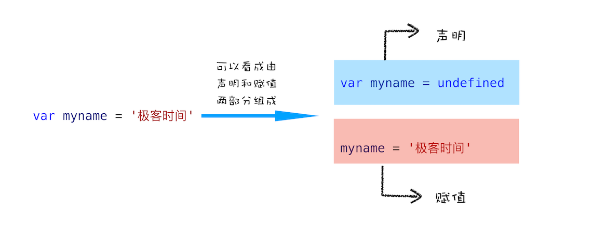
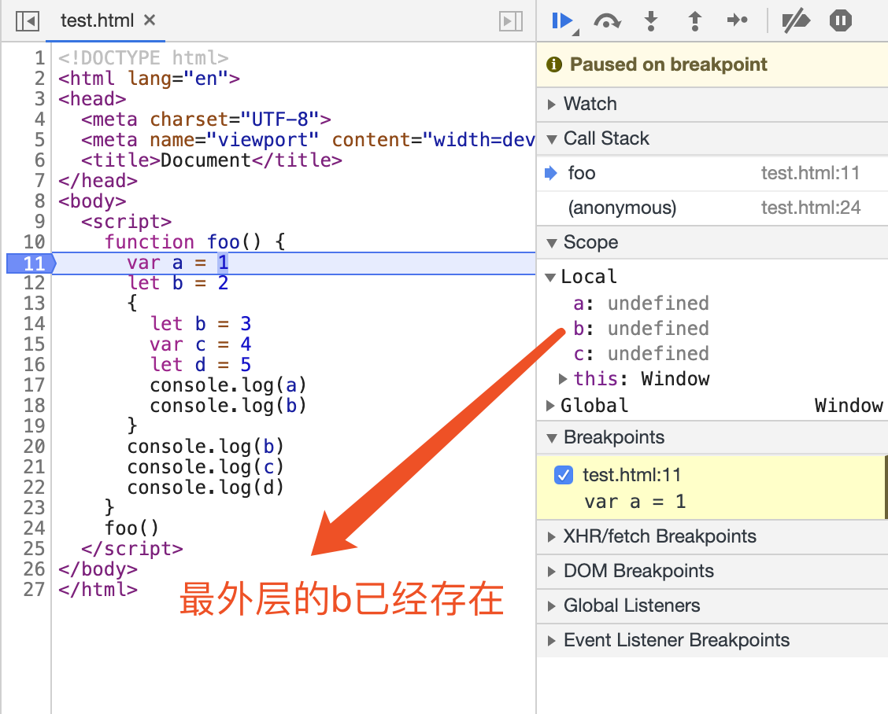
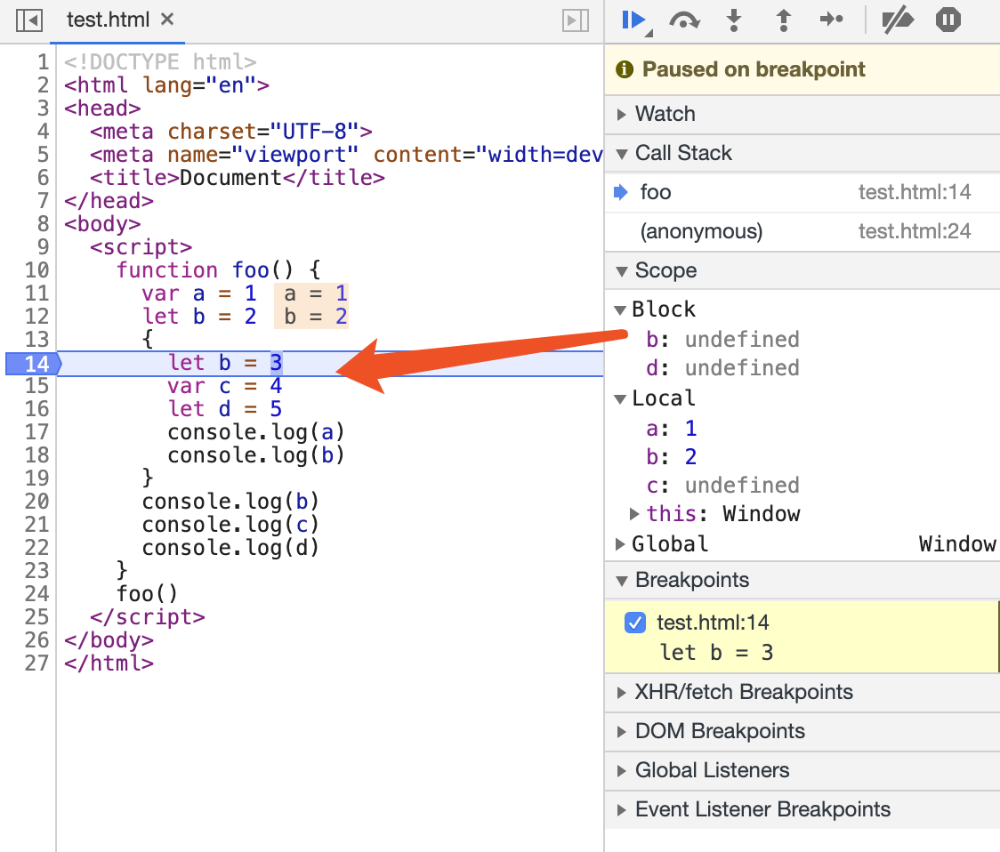

疑问：**JavaScript代码是按顺序执行的吗？为什么JavaScript代码会出现栈溢出？var缺陷以及为什么要引入let和const？**

## 变量提升：JavaScript代码是按顺序执行的吗？

### JavaScript中的声明和赋值
变量的声明和赋值：


函数的声明和赋值：


### 变量提升
**所谓的变量提升，是指在JavaScript代码执行过程中，JavaScript引擎把变量的声明部分和函数的声明部分提升到代码开头的“行为”。变量被提升后，会给变量设置默认值，这个默认值就是我们熟悉的 `undefined`。**


### JavaScript代码的执行流程
从概念的字面意义上来看，“变量提升”意味着变量和函数的声明会在物理层面移动到代码的最前面，正如我们所模拟的那样。但，这并不准确。**实际上变量和函数声明在代码里的位置是不会改变的，而且是在`编译阶段`被JavaScript引擎放入内存中。**也就是说，`一段JavaScript代码在执行之前需要被JavaScript引擎编译，编译完成之后，才会进入执行阶段`。

#### 编译阶段
- 第一部分：变量提升部分的代码。
- 第二部分：执行部分的代码。


- 输入一段代码，经过编译后，会生成两部分内容：**执行上下文（Execution context）和可执行代码**。
- **执行上下文是JavaScript执行一段代码时的运行环境**，在执行上下文中存在一个`变量环境的对象（Viriable Environment）`，该对象中保存了变量提升的内容。
- 第4行，JavaScript引擎发现了一个通过function定义的函数，所以**它`将函数定义存储到堆 (HEAP）`中，并在环境对象中创建一个showName的属性，然后将该属性值指向堆中函数的位置**。

#### 执行阶段
**JavaScript引擎开始执行“可执行代码”，按照顺序一行一行地执行。**遇到变量或函数时，会去变量环境对象中取值，赋值操作也会去修改变量环境对象的值。

### 总结
- JavaScript代码执行过程中，需要先做**变量提升**，而之所以需要实现变量提升，是因为JavaScript代码在执行之前需要先**编译**。
- 在**编译阶段**，变量和函数会被存放到**变量环境**中，变量的默认值会被设置为undefined；在代码**执行阶段**，JavaScript引擎会从变量环境中去查找自定义的变量和函数。
- 如果在编译阶段，存在两个相同的函数，那么最终存放在变量环境中的是最后定义的那个，这是因为后定义的会覆盖掉之前定义的。
- JavaScript的执行机制：**先编译，再执行**。


## 调用栈：为什么JavaScript代码会出现栈溢出？
哪些情况下代码才算是“一段”代码，才会在执行之前就进行编译并创建执行上下文：
- 当JavaScript执行全局代码的时候，会编译全局代码并创建`全局执行上下文`，而且在整个页面的生存周期内，全局执行上下文只有一份。
- 当调用一个函数的时候，函数体内的代码会被编译，并创建`函数执行上下文`，一般情况下，函数执行结束之后，创建的函数执行上下文会被销毁。
- 当使用`eval函数`的时候，eval的代码也会被编译，并创建执行上下文。

**调用栈就是用来`管理函数调用关系`的一种数据结构。**

### 什么是JavaScript的调用栈
JavaScript引擎正是利用栈的这种结构来管理执行上下文的。在执行上下文创建好后，JavaScript引擎会将执行上下文压入栈中，通常把这种用来管理执行上下文的栈称为**执行上下文栈，又称调用栈**。

```javascript
var a = 2
function add(b, c) {
  return b + c
}
function addAll(b, c) {
  var d = 10
  result = add(b, c)
  return a + result + d
}
addAll(3, 6)
```
- **第一步，创建全局执行上下文，并将其压入栈底。**全局执行上下文`压入到调用栈后`，JavaScript引擎便`开始执行全局代码`了。首先会执行a=2的赋值操作，执行该语句会将全局上下文变量环境中a的值设置为2。
- **第二步，是调用addAll函数。**当调用该函数时，JavaScript引擎会`编译`该函数，并为其创建一个`执行上下文`，最后还将该函数的执行上下文`压入栈中`。addAll函数的执行上下文创建好之后，便进入了函数代码的执行阶段。
- **第三步，当执行到add函数**调用语句时，同样会为其创建执行上下文，并将其压入调用栈。


### 在开发中，如何利用好调用栈
**1 如何利用浏览器查看调用栈的信息？**

- 打断点，查看Call Stack。
- 使用`console.trace()`来输出当前的函数调用关系。

**2 栈溢出（Stack Overflow）**

**调用栈是有大小的**，当入栈的执行上下文超过一定数目，JavaScript引擎就会报错，我们把这种错误叫做**栈溢出**。


### 总结
- 每调用一个函数，JavaScript引擎会为其`创建执行上下文`，并把该执行上下文`压入调用栈`，然后JavaScript引擎`开始执行函数代码`。
- 当前函数执行完毕后，JavaScript引擎会将该函数的执行上下文`弹出`栈。
- 当分配的调用栈空间被占满时，会引发“堆栈溢出”问题。


## 块级作用域：var缺陷以及为什么要引入let和const？
- “探病因”——为什么在JavaScript中会存在变量提升，以及变量提升所带来的问题；
- “开药方”——如何通过块级作用域并配合let和const关键字来修复这种缺陷。

### 为什么JavaScript中会存在变量提升这个特性，而其他语言似乎都没有这个特性呢？
- **作用域是变量与函数的可访问范围，即作用域控制着变量和函数的可见性和生命周期。**
- 在ES6之前，ES的作用域只有两种：全局作用域和函数作用域。
- 因为当初设计这门语言的时候，并没有想到JavaScript会火起来，所以只是按照最简单的方式来设计。没有了块级作用域，再把作用域内部的变量统一提升无疑是`最快速、最简单`的设计。


### 变量提升所带来的问题
1. **变量容易在不被察觉的情况下被覆盖掉**
2. **本应销毁的变量没有被销毁**


### ES6是如何解决变量提升带来的缺陷
**ES6引入了let和const关键字**，从而使JavaScript也能像其他语言一样拥有了`块级作用域`。


### JavaScript是如何支持块级作用域的
疑问：
- **在同一段代码中，ES6是如何做到既要支持变量提升的特性，又要支持块级作用域的呢？**
- **JavaScript引擎是通过变量环境实现函数级作用域的，那么ES6又是如何在函数级作用域的基础之上，实现对块级作用域的支持呢？**

```javascript
function foo() {
  var a = 1
  let b = 2
  {
    let b = 3
    var c = 4
    let d = 5
    console.log(a)
    console.log(b)
  }
  console.log(b)
  console.log(c)
  console.log(d)
}
foo()
```

**第一步是编译并创建执行上下文**：

- 函数内部通过var声明的变量，在`编译阶段`全都被存放到**变量环境**里面了。
- 通过let声明的变量，在`编译阶段`会被存放到**词法环境（Lexical Environment）**中。
- 在函数的作用域块内部，通过let声明的变量并没有被存放到词法环境中。
- **`函数只会在第一次执行的时候被编译`，所以编译时变量环境和词法环境最顶层数据已经确定了**。
- **执行函数时才有进行编译，抽象语法树(AST)在进入函数阶段就生成了，并且函数内部作用域是已经明确了，所以进入块级作用域不会有编译过程**，只不过`通过let或者const声明的变量会在进入块级作用域时被创建`(**一进到块就开始创建了**)，但是在该变量没有赋值之前，引用该变量JavaScript引擎会抛出错误---这就是`“暂时性死区”`。


**第二步继续执行代码，当执行到代码块里面时，变量环境中a的值已经被设置成了1，词法环境中b的值已经被设置成了2**：

- 当进入函数的作用域块时，作用域块中通过let声明的变量，会被存放在词法环境的一个`单独的`区域中。
- 在**词法环境**内部，维护了一个**小型栈结构**，`栈底是函数最外层的变量`，进入一个作用域块后，就会把该作用域块内部的变量压到栈顶；**当作用域块执行完成之后，该作用域块的信息就会从栈顶弹出**，这就是词法环境的结构。


**变量查找过程**：

具体查找方式是：沿着`词法环境`的栈顶向下查询，如果在词法环境中的某个块中查找到了，就直接返回给JavaScript引擎，如果没有查找到，那么继续在`变量环境`中查找。


**代码执行，打断点**：


**进入块级作用域**：


### 总结
**`块级作用域`就是通过`词法环境`的栈结构来实现的，而`变量提升`是通过`变量环境`来实现**，通过这两者的结合，JavaScript引擎也就同时支持了变量提升和块级作用域了。
