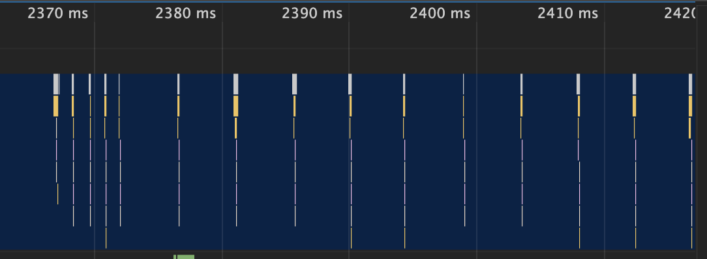

## 消息队列和事件循环：页面是怎么“活”起来的？

每个渲染进程都有一个主线程，并且主线程非常繁忙，既要处理DOM，又要计算样式，还要处理布局，同时还需要处理JavaScript任务以及各种输入事件。**要让这么多不同类型的任务在主线程中有条不紊地执行，这就需要一个系统来统筹调度这些任务**，这个统筹调度系统就是`消息队列和事件循环系统`。

### 在线程运行过程中处理新任务
要想在线程运行过程中，能接收并执行新的任务，就需要采用事件循环机制。
- 循环机制
- 事件机制

### 处理其他线程发送过来的任务
**如何设计好一个线程模型，让其能够接收其他线程发送的消息呢？**使用`消息队列`。


- 添加一个消息队列；
- IO线程中产生的**新任务添加进消息队列尾部**；
- `渲染主线程`会**循环地从消息队列头部中读取任务，执行任务**。

**由于是多个线程操作同一个消息队列，所以在添加任务和取出任务时还会加上一个同步锁。**

### 处理其他进程发送过来的任务
**渲染进程专门有一个IO线程用来接收其他进程传进来的消息**，接收到消息之后，会`将这些消息组装成任务`发送给渲染主线程。


### 消息队列中的任务类型
消息队列中的任务类型有哪些？可以参考[官方Chromium的源码](https://cs.chromium.org/chromium/src/third_party/blink/public/platform/task_type.h)。
- 包含了很多内部消息类型，如**输入事件(鼠标滚动、点击、移动)、微任务、文件读写、WebSocket、JavaScript定时器等等**。
- 除此之外，消息队列中还包含了很多`与页面相关的事件`，如JavaScript执行、解析DOM、样式计算、布局计算、CSS动画等。

### 当页面主线程执行完成之后，又该如何保证页面主线程能够安全退出呢？
Chrome是这样解决的，确定要退出当前页面时，页面主线程会设置一个`退出标志的变量`，**在每次执行完一个任务时，判断是否有设置退出标志**。
```java
TaskQueue task_queue;
void ProcessTask();
bool keep_running = true;
void MainThread() {
  for (;;) {
    Task task = task_queue.takeTask();
    ProcessTask(task);
    if (!keep_running) // 如果设置了退出标志，那么直接退出线程循环
      break; 
  }
}
```

### 页面使用单线程的缺点
消息队列是“先进先出”的属性，也就是说放入队列中的任务，需要等待前面的任务被执行完，才会被执行。鉴于这个属性，就有如下两个问题需要解决。

#### 第一个问题是如何处理高优先级的任务。
比如一个典型的场景是监控DOM节点的变化情况（节点的插入、修改、删除等动态变化），然后根据这些变化来处理相应的业务逻辑。
- 如果DOM发生变化，采用`同步`通知的方式，会影响当前任务的`执行效率`；
- 如果采用`异步`方式，又会影响到`监控的实时性`。

**那该如何权衡效率和实时性呢？**针对这种情况，`微任务`就应运而生了。
- **通常我们把消息队列中的任务称为`宏任务`，每个宏任务中都包含了一个`微任务队列`**，在执行宏任务的过程中，如果DOM有变化，那么就会将该变化添加到微任务列表中，这样就不会影响到宏任务的继续执行，因此也就解决了执行效率的问题。
- 等宏任务中的主要功能都直接完成之后，这时候，**渲染引擎并不着急去执行下一个宏任务，而是执行当前宏任务中的微任务**，因为DOM变化的事件都保存在这些微任务队列中，这样也就解决了实时性问题。

#### 第二个是如何解决单个任务执行时长过久的问题。
因为所有的任务都是在单线程中执行的，所以每次只能执行一个任务，而其他任务就都处于等待状态。如果其中一个任务执行时间过久，那么下一个任务就要等待很长时间。

- 如果在执行动画过程中，其中有个JavaScript任务因执行时间过久，占用了动画单帧的时间，这样会给用户制造了卡顿的感觉。
- 针对这种情况，JavaScript可以通过`回调功能`来规避这种问题，也就是让要执行的JavaScript任务滞后执行。

### 结合消息队列和事件循环，你认为微任务是什么？引入微任务能带来什么优势呢？


## WebAPI：setTimeout是如何实现的？
setTimeout是一个**定时器，用来指定某个函数在多少毫秒之后执行**。它会返回一个整数，表示定时器的编号，同时你还可以通过该编号来取消这个定时器。

### 浏览器怎么实现setTimeout
要执行一段异步任务，需要先将任务添加到消息队列中。不过通过定时器设置回调函数有点特别，它们需要在指定的时间间隔内被调用，`但消息队列中的任务是按照顺序执行的`，**所以为了保证回调函数能在指定时间内执行，你不能将定时器的回调函数直接添加到消息队列中**。

#### 那如何设计才能让定时器设置的回调事件在规定时间内被执行？要在消息循环系统的基础上加定时器的功能，你会如何设计？
- 在Chrome中除了正常使用的消息队列之外，还有另外一个消息队列，这个队列中维护了`需要延迟执行的任务列表`，**包括了定时器和Chromium内部一些需要延迟执行的任务**。所以当通过JavaScript创建一个定时器时，渲染进程会将该定时器的回调任务添加到延迟队列中。可以参考[Chromium中关于队列部分的源码](https://cs.chromium.org/chromium/src/base/task/sequence_manager/task_queue_impl.h)。
- 当通过JavaScript调用setTimeout设置回调函数的时候，**`渲染进程将会创建一个回调任务`，包含了回调函数showName、当前发起时间、延迟执行时间**。
- 创建好回调任务之后，再将该任务添加到延迟执行队列中。

```java
struct DelayTask {
  int64 id；
  CallBackFunction cbf;
  int start_time;
  int delay_time;
};
DelayTask timerTask;
timerTask.cbf = showName;
timerTask.start_time = getCurrentTime(); // 获取当前时间
timerTask.delay_time = 200; // 设置延迟执行时间

DelayedIncomingQueue delayed_incoming_queue;
delayed_incoming_queue.push(timerTask);
```

#### 现在通过定时器发起的任务被保存到延迟队列中了，那消息循环系统是怎么触发延迟队列的？
```java
void ProcessTimerTask() {
  // 从 delayed_incoming_queue 中取出已经到期的定时器任务
  // 依次执行这些任务
}

TaskQueue task_queue;
void ProcessTask();
bool keep_running = true;
void MainTherad() {
  for (;;) {
    // 执行消息队列中的任务
    Task task = task_queue.takeTask();
    ProcessTask(task);

    // 执行延迟队列中的任务
    ProcessDelayTask();

    if (!keep_running) // 如果设置了退出标志，那么直接退出线程循环
      break;
  }
}
```
- 上面👆代码添加了一个`ProcessDelayTask`函数，该函数是专门用来处理延迟执行任务的。
- 这里我们要重点关注它的执行时机，在上段代码中，**处理完消息队列中的一个任务之后，就开始执行ProcessDelayTask函数**。
- **ProcessDelayTask函数会根据发起时间和延迟时间计算出到期的任务，然后`依次执行这些到期的任务`。等到期的任务执行完成之后，再继续下一个循环过程**。
- 当一个定时器的任务还没有被执行的时候，是可以取消的。**浏览器内部实现取消定时器的操作，就是直接从delayed_incoming_queue延迟队列中，通过ID查找到对应的任务并将其从队列中删除**。


### 使用setTimeout的一些注意事项

#### 1 如果当前任务执行时间过久，会延迟到期定时器任务的执行
```javascript
function bar() {
  console.log('bar')
}
function foo() {
  setTimeout(bar, 0);
  for (let i = 0; i < 5000; i++) {
    let i = 5 + 8 + 8 + 8
    console.log(i)
  }
}
foo()
```

#### 2 如果setTimeout存在嵌套调用，那么系统会设置最短时间间隔为4毫秒
```javascript
function cb() {
  setTimeout(cb, 0);
}
setTimeout(cb, 0);
```

- 上图中的竖线就是定时器的函数回调过程，从图中可以看出，前面五次调用的时间间隔比较小，嵌套调用超过五次以上，后面每次的调用最小时间间隔是4毫秒。
- 之所以出现这样的情况，是因为**在Chrome中，`定时器被嵌套调用5次以上`，系统会判断该函数方法被阻塞了，如果定时器的调用时间间隔小于4毫秒，那么浏览器会将每次调用的时间间隔设置为4毫秒**。
- 所以，一些实时性较高的需求就不太适合使用setTimeout了。比如实现JS动画。

#### 3 未激活的页面，setTimeout执行最小间隔是1000毫秒
**如果标签不是当前的激活标签，那么定时器最小的时间间隔是1000毫秒，目的是为了`优化后台页面的加载损耗以及降低耗电量`。**

#### 4 延时执行时间有最大值
- Chrome、Safari、Firefox 都是以32个bit来存储延时值的，32bit最大只能存放的数字是2147483647毫秒。
- 这就意味着，如果setTimeout设置的延迟值大于2147483647毫秒（大约24.8天）时就会**溢出，这导致定时器会被`立即执行`**。

#### 5 使用setTimeout设置的回调函数中的this不符合直觉
- 如果被setTimeout推迟执行的回调函数是某个对象的方法，那么该方法中的this关键字将指向`全局环境`，而不是定义时所在的那个对象。**因为代码在编译的时候，执行上下文中的this会被设置为全局window，如果是严格模式，会被设置为undefined。**

```javascript
var name= 1;
var MyObj = {
  name: 2,
  showName: function() {
    console.log(this.name); // 1
  }
}
setTimeout(MyObj.showName, 1000); // 这相当于将MyObj.showName赋值给了匿名函数，所以this指向全局对象

// 解决方案：1.在匿名函数中执行(箭头函数/function函数) 2.使用bind修改this指向
setTimeout(() => MyObj.showName(), 1000);
setTimeout(function() {
  MyObj.showName()
}, 1000)
setTimeout(MyObj.showName.bind(MyObj), 1000)
```

### 了解下requestAnimationFrame的工作机制，并对比setTimeout，然后分析出requestAnimationFrame实现的动画效果比setTimeout好的原因。
- requestAnimationFrame提供一个原生的API去执行动画的效果，它会在一帧（一般是16ms）间隔内根据浏览器情况去执行相关动作，即它会`按照系统刷新的节奏调用`。
- setTimeout是在特定的时间间隔去执行任务，不到时间间隔不会去执行，这样浏览器就没有办法去自动优化。
