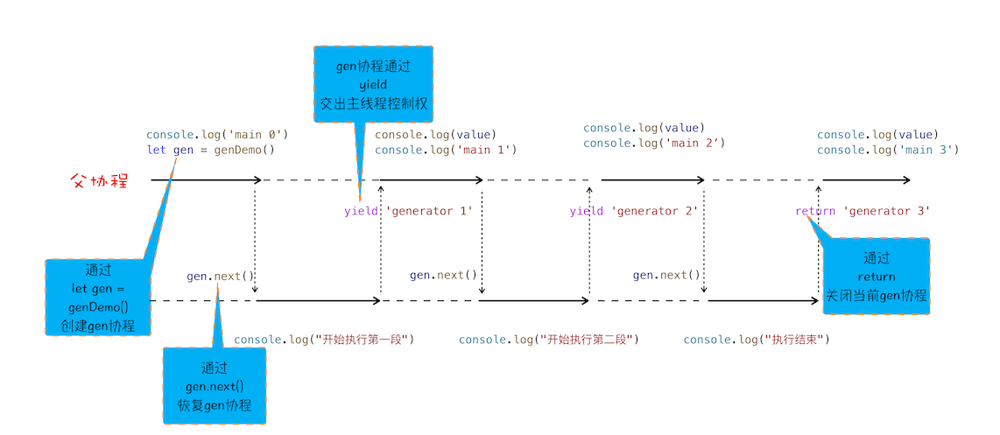
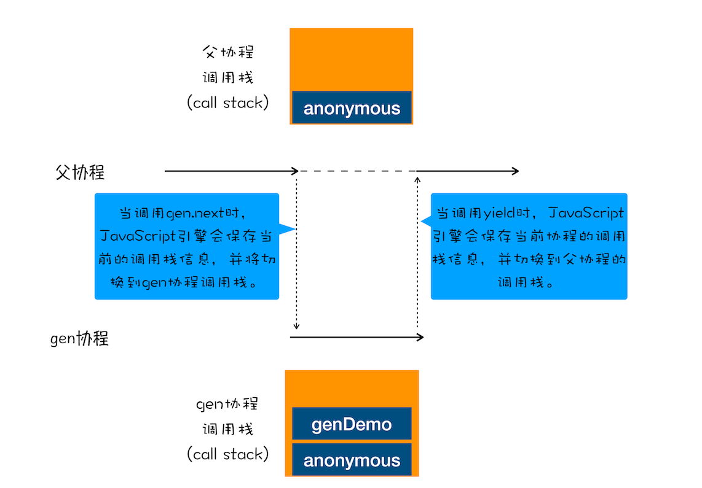

## Promise：使用Promise，告别回调函数
**Promise解决的是异步编码风格的问题。**

### 异步编程的问题：代码逻辑不连续
Web页面的单线程架构决定了异步回调，而异步回调影响到了我们的编码方式，到底是如何影响的呢？

**太多回调会导致代码的逻辑不连贯、不线性，非常不符合人的直觉。**


### 封装异步代码，让处理流程变得线性
将异步过程封装起来，**重点关注输入内容（请求信息）和输出内容（回复信息）**。


### 新的问题：回调地狱
- 第一是**嵌套调用**，下面的任务依赖上个任务的请求结果，并在上个任务的回调函数内部执行新的业务逻辑，这样当嵌套层次多了之后，代码的`可读性`就变得非常差了。
- 第二是**任务的不确定性**，执行每个任务都有两种可能的结果（成功或者失败），所以体现在代码中就需要对每个任务的执行结果做两次判断，这种对每个任务都要进行一次额外的错误处理的方式，明显增加了代码的`混乱`程度。

解决思路：
- **第一是消灭嵌套调用**；
- **第二是合并多个任务的错误处理**。


### Promise：消灭嵌套调用和多次错误处理

#### Promise是怎么消灭嵌套回调的？
产生嵌套函数的一个主要原因是在发起任务请求时会带上回调函数，这样当任务处理结束之后，下个任务就只能在回调函数中来处理了。

Promise主要通过下面两步解决嵌套回调问题：
- **首先，Promise实现了`回调函数的延迟绑定`**。先创建Promise对象，再通过then设置回调。
- **其次，需要将回调函数onResolve的返回值穿透到最外层**。在onResolve内可以直接return值，这样该值通过then可以传递下去。

#### Promise是怎么处理异常的？
- Promise对象的错误具有`“冒泡”`性质，会一直向后传递，直到被`onReject函数处理或catch语句捕获`为止。
- 具备了这样“冒泡”的特性后，就不需要在每个Promise对象中单独捕获异常了。


### Promise与微任务
```javascript
// 模拟Promise的实现
function Bromise(executor) {
  var _onResolve = null
  var _onReject = null
  // 模拟实现 resolve 和 then，暂不支持 rejcet
  this.then = function (onResolve, onReject) {
    _onResolve = onResolve
  }
  function resolve(value) {
    // 由于then回调延迟绑定，所以在调用到_onResolve函数的时候，Bromise.then还没有执行，因此这里需要用setTimeout包起来。
    setTimeout(() => {
      _onResolve(value)
    }, 0)
  }
  executor(resolve, null)
}

// 使用
function executor(resolve, reject) {
  resolve(100)
}
let demo = new Bromise(executor)
function onResolve(value) {
  console.log(value)
}
demo.then(onResolve)
```

- **由于then回调延迟绑定，所以在调用到_onResolve函数的时候，Bromise.then还没有执行，因此这里需要用setTimeout包起来。**
- **不过使用定时器的效率并不是太高，`Promise又把这个定时器改造成了微任务`**。这样既可以让_onResolve延时被调用，又提升了代码的执行效率。
- `Promise之所以要使用微任务是由Promise回调函数延迟绑定技术导致的`。


### 思考题
#### Promise中为什么要引入微任务？
#### Promise中是如何实现回调函数返回值穿透的？
#### Promise出错后，是怎么通过“冒泡”传递给最后那个捕获异常的函数？


## async/await：使用同步的方式去写异步代码
**ES7引入了async/await，这是JavaScript异步编程的一个重大改进，提供了`在不阻塞主线程的情况下使用同步代码实现异步访问资源`的能力，并且使得代码逻辑更加清晰。**

### 生成器VS协程
```javascript
function* genDemo() {
  console.log('开始执行第一段')
  yield 'generator 2'

  console.log('开始执行第二段')
  yield 'generator 2'

  console.log('开始执行第三段')
  yield 'generator 2'

  console.log('执行结束')
  return 'generator 2'
}
 
console.log('main 0')
let gen = genDemo()
console.log(gen.next().value)
console.log('main 1')
console.log(gen.next().value)
console.log('main 2')
console.log(gen.next().value)
console.log('main 3')
console.log(gen.next().value)
console.log('main 4')
```

#### 什么是生成器函数？
**生成器函数是一个带星号函数，而且是可以暂停执行和恢复执行的。**
- 在生成器函数内部执行一段代码，如果遇到`yield`关键字，那么JavaScript引擎将`返回关键字后面的内容给外部`，并`暂停该函数的执行`。
- 外部函数可以通过`next`方法`恢复函数的执行`。

#### JavaScript引擎V8是如何实现一个函数的暂停和恢复的？
要搞懂函数为何能暂停和恢复，那首先要了解协程的概念。
- **协程是一种比线程更加轻量级的存在**。
- 可以把协程看成是跑在线程上的任务，`一个线程上可以存在多个协程，但是在线程上同时只能执行一个协程`。
- **如果从A协程启动B协程，我们就把A协程称为B协程的父协程**。
- **协程不是被操作系统内核所管理，而完全是`由程序所控制（也就是在用户态执行）`**。这样带来的好处就是性能得到了很大的提升，不会像线程切换那样消耗资源。
- **生成器就是协程的一种实现方式**。

协程执行流程：


#### 切换不同协程时，V8是如何切换不同协程的调用栈的？
**父协程有自己的调用栈，gen协程时也有自己的调用栈，当gen协程通过yield把控制权交给父协程时，V8是如何切换到父协程的调用栈？当父协程通过gen.next恢复gen协程时，又是如何切换gen协程的调用栈？**
- gen协程和父协程是在主线程上交互执行的，并不是并发执行的，它们之间的切换是通过yield和gen.next来配合完成的。
- 当在`gen协程`中调用了`yield`方法时，JavaScript引擎会保存gen协程当前的调用栈信息，并恢复父协程的调用栈信息。同样，当在`父协程`中执行`gen.next`时，JavaScript引擎会保存父协程的调用栈信息，并恢复gen协程的调用栈信息。


#### 用生成器+Promise改造async/await代码
```javascript
async function foo() {
  try{
    let response1 = await fetch('https://www.geekbang.org')
    console.log('response1', response1)
    let response2 = await fetch('https://www.geekbang.org/test')
    console.log('response2', response2)
  } catch(err) {
    console.error(err)
  }
}
foo()
```

生成器 + Promise改造后代码：
```javascript
// foo 函数
function* foo() {
  let response1 = yield fetch('https://www.geekbang.org')
  console.log('response1', response1)
  let response2 = yield fetch('https://www.geekbang.org/test')
  console.log('response2', response2)
}
 
// 执行 foo 函数的代码
let gen = foo()
function getGenPromise(gen) {
  return gen.next().value   // value返回的是fetch的返回值，即Promise对象
}
getGenPromise(gen).then((response) => {
  console.log('response1', response)
  return getGenPromise(gen)
}).then((response) => {
  console.log('response2', response)
})
```
**通常会把执行生成器的代码封装成一个函数，并把这个执行生成器代码的函数称为执行器（可参考著名的 co 框架）。**


### async/await
async/await技术背后的秘密就是**Promise和生成器应用**，往底层说就是**微任务和协程应用**。

#### async是什么？
async是一个通过**异步执行**并**隐式返回Promise**作为结果的函数。
```javascript
async function foo() {
  return 2
}
console.log(foo())  // Promise {<resolved>: 2}
```

#### await是什么？
```javascript
async function foo() {
  console.log(1)
  let a = await 100
  console.log(a)
  console.log(2)
}
console.log(0)
foo()
console.log(3)
// 0 1 3 100 2
```


当执行到`let a = await 100`时：
- 当执行到await 100时，会默认创建一个Promise对象。`let promise_ = new Promise((resolve, reject) => resolve(100))`
- 在这个promise_对象创建的过程中，调用了resolve函数，**JavaScript引擎将该任务提交给微任务队列**。
- 然后JavaScript引擎会`暂停当前协程的执行`，将主线程的控制权转交给父协程执行，同时会将promise_对象返回给父协程。
- 主线程的控制权已经交给父协程了，这时候`父协程`要做的一件事是`调用promise_.then来监控promise状态的改变`。
- 接下来继续执行父协程的流程，这里执行console.log(3)，并打印出来3。
- 随后**父协程将执行结束，在结束之前，会进入微任务的检查点，然后执行微任务队列**，微任务队列中有resolve(100)的任务等待执行，执行到这里的时候，会触发promise_.then中的回调函数。
- 该回调函数被激活以后，会将主线程的控制权交给foo函数的协程，并同时将value值传给该协程。
- foo协程激活之后，会把刚才的value值赋给了变量a，然后foo协程继续执行后续语句，执行完成之后，将控制权归还给父协程。

#### 思考题
```javascript
async function foo() {
  console.log('foo')
}
async function bar() {
  console.log('bar start')
  await foo()
  console.log('bar end')
}
console.log('script start')
setTimeout(() => console.log('setTimeout'), 0)
bar()
new Promise(resolve => {
  console.log('promise executor')
  resolve()
}).then(() => {
  console.log('promise then')
})
console.log('script end')
// script start，bar start，foo，promise executor，script end，bar end，promise then，setTimeout
```
