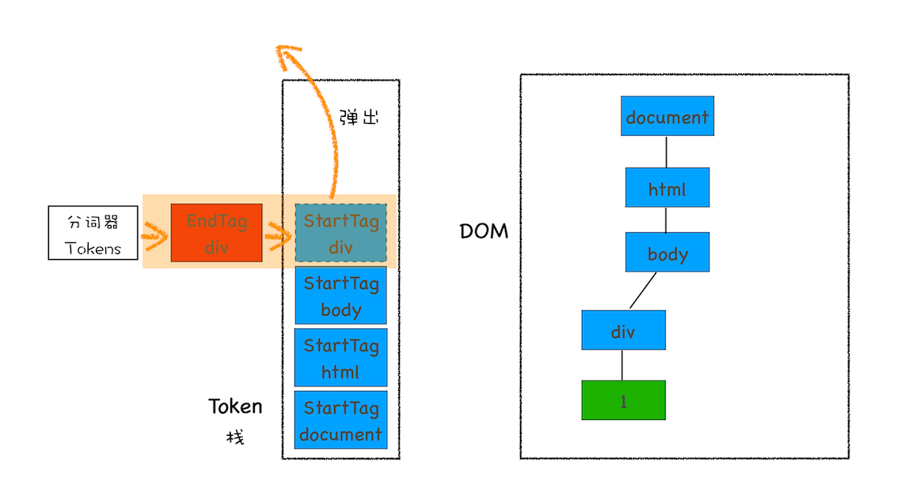

## Chrome开发者工具：利用网络面板做性能分析
网络面板由控制器、过滤器、抓图信息、时间线、详细列表和下载信息概要这6个区域构成。


- `DOMContentLoaded`，这个事件发生后，说明`页面已经构建好DOM`了，这意味着构建DOM所需要的HTML文件、JavaScript文件、CSS文件都已经下载完成了。
- `Load`，说明浏览器已经`加载了所有的资源（图像、样式表等）`。

### 优化时间线上耗时项
#### 1 排队(Queuing)时间过久
排队时间过久，大概率是由浏览器为每个域名最多维护6个连接导致的。那么基于这个原因，可以让1个站点下面的资源放在多个域名下面，这种方案称为**域名分片技术**。除了域名分片技术外，建议把站点升级到**HTTP2**，因为HTTP2已经没有每个域名最多维护6个TCP连接的限制了。

#### 2 第一字节时间(TTFB)时间过久
可能的原因以及对应的解决方案：
- **服务器生成页面数据的时间过久**。解决：提高服务器的处理速度，比如增加各种`缓存`的技术。
- **网络的原因**。解决：使用`CDN`来`缓存`一些静态文件。
- **发送请求头时带上了多余的用户信息**。在发送请求时就去尽可能地减少一些不必要的Cookie数据信息。

#### 3 Content Download时间过久
可能是字节数太多的原因导致。解决：`减少文件大小`，比如压缩、去掉源码中不必要的注释等方法。


## DOM树：JavaScript是如何影响DOM树构建的？
思考：
- DOM树是怎么生成的？
- 在解析过程中遇到JavaScript脚本，DOM解析器是如何处理的？
- DOM解析器是如何处理跨站点资源的？

### 什么是DOM？
从网络传给渲染引擎的`HTML文件字节流`是无法直接被渲染引擎理解的，所以要将其`转化为渲染引擎能够理解的内部结构`，这个结构就是DOM。

在渲染引擎中，DOM有三个层面的作用。
- 从**页面**的视角来看，DOM是生成页面的**基础数据结构**。
- 从**JavaScript脚本**视角来看，DOM**提供给JavaScript脚本操作的接口**，通过这套接口，JavaScript可以对DOM结构进行访问，从而改变文档的结构、样式和内容。
- 从**安全**视角来看，DOM是一道安全防护线，一些不安全的内容在`DOM解析阶段`就被拒之门外了。

### DOM树是如何生成的？
在**渲染引擎**内部，有一个叫`HTML解析器(HTMLParser)`的模块，它的职责就是负责**将HTML字节流转换为DOM结构**。

**HTML解析器是等整个HTML文档加载完成之后开始解析的，还是随着HTML文档边加载边解析的？**
- HTML解析器并不是等整个文档加载完成之后再解析的，而是`网络进程加载了多少数据，HTML解析器便解析多少数据`。
- 网络进程接收到响应头之后，会根据响应头中的content-type字段来判断文件的类型，然后为该请求选择或者创建一个渲染进程。
- 渲染进程准备好之后，**网络进程和渲染进程之间会建立一个`共享数据的管道`**，网络进程接收到数据后就往这个管道里面放，而渲染进程则从管道的另外一端不断地读取数据，并同时将读取的数据“喂”给HTML解析器。

字节流转换为DOM需要三个阶段：
- **第一个阶段，通过分词器将字节流转换为Token（tag token和文本token）。**
- **第二个和第三个阶段是同步进行的，需要将Token解析为DOM节点，并将DOM节点添加到DOM树中。**

`HTML解析器维护了一个Token栈结构`，**该Token栈主要用来计算节点之间的父子关系**，在第一个阶段中生成的Token会被按照顺序压到这个栈中。
- 如果压入到栈中的是**StartTag Token**，HTML解析器会为该Token创建一个DOM节点，然后将该节点加入到DOM树中，它的`父节点就是栈中相邻的那个元素生成的节点`。
- 如果分词器解析出来是**文本Token**，那么会生成一个文本节点，然后将该节点加入到DOM树中，`文本Token是不需要压入到栈中`，它的`父节点就是当前栈顶Token所对应的DOM节点`。
- 如果分词器解析出来的是**EndTag Token**，比如是EndTag div，HTML解析器会查看Token栈顶的元素是否是StarTag div，如果是，就`将StartTag div从栈中弹出`，表示该div元素解析完成。

```html
<html>
<body>
  <div>1</div>
  <div>test</div>
</body>
</html>
```
DOM生成过程：


### JavaScript是如何影响DOM生成的？
#### 在两段div中间插入了一段JavaScript脚本(在页面中直接内嵌JavaScript脚本)
- `HTML解析器暂停工作`，**JavaScript引擎介入**，并执行script标签中的脚本。
- 脚本执行完成之后，HTML解析器恢复解析过程，继续解析后续的内容，直至生成最终的DOM。

#### 在页面中引入JavaScript文件
- JavaScript文件的下载过程会阻塞DOM解析。
- Chrome浏览器做了很多优化，其中一个主要的优化是**预解析操作**。**当渲染引擎收到字节流之后**，会开启一个`预解析线程`，用来分析HTML文件中包含的JavaScript、CSS等相关文件，解析到相关文件之后，预解析线程会`提前下载`这些文件。
- 引入JavaScript线程会阻塞DOM，也有一些相关的策略来规避：
  - 使用`CDN`来加速JavaScript文件的加载。
  - `压缩`JavaScript文件的体积。
  - **如果JavaScript文件中没有操作DOM相关代码**，就可以将该JavaScript脚本设置为`异步加载`，通过`async或defer`来标记代码。
  - 使用async标志的脚本文件一旦加载完成，会立即执行；而使用了defer标记的脚本文件，需要在DOMContentLoaded事件之前执行。

#### 在页面中引入CSS文件和JavaScript脚本
- JavaScript引擎在解析JavaScript之前，是不知道JavaScript是否操纵了CSSOM的，所以渲染引擎在遇到JavaScript脚本时，`不管该脚本是否操纵了CSSOM，都会执行CSS文件下载，解析操作，再执行JavaScript脚本`。
- **JavaScript会阻塞DOM生成，而样式文件又会阻塞JavaScript的执行。**


## 渲染流水线：CSS如何影响首次加载时的白屏时间？

### 当页面中仅仅引入了CSS文件的渲染流程


### 渲染流水线为什么需要CSSOM呢？
和HTML一样，渲染引擎也是无法直接理解CSS文件内容的，所以需要将其解析成渲染引擎能够理解的结构，这个结构就是CSSOM。CSSOM有两个作用：
- **第一个是提供给`JavaScript操作样式表`的能力。**
- **第二个是为`布局树`的合成提供基础的样式信息。**
- CSSOM体现在DOM中就是`document.styleSheets`。

### 当页面中既引入CSS文件又有JavaScript脚本时的渲染流程
**因为JavaScript有修改CSSOM的能力，所以在执行JavaScript之前，还需要依赖CSSOM。也就是说`CSS在部分情况下也会阻塞DOM的生成`。**


### HTML中包含了CSS的外部引用和JavaScript外部文件的渲染流程
注意：**HTML预解析器识别出有CSS文件和JavaScript文件需要下载，然后`同时`发起这两个文件的下载请求。**


### 影响页面展示的因素以及优化策略
- 第一阶段：请求数据。网络或者服务器处找原因。
- 第二阶段：提交数据之后渲染进程会创建一个空白页面，我们通常把这段时间称为**解析白屏**，并等待CSS文件和JavaScript文件的加载完成，生成CSSOM和DOM，然后合成布局树，最后还要经过一系列的步骤准备首次渲染。
  - 解析HTML
  - `下载CSS`
  - `下载JavaScript`
  - 生成CSSOM
  - `执行JavaScript`
  - 生成布局树
  - 绘制页面
- 第三阶段：等首次渲染完成之后，就开始进入完整页面的生成阶段了，然后页面会一点点被绘制出来。

**缩短白屏时间的解决方案：**
- 通过`内联JavaScript、内联CSS`来移除这两种类型的文件下载，这样获取到HTML文件之后就可以直接开始渲染流程了。
- 尽量减小文件大小。webpack，移除注释、压缩等。
- 将一些**不需要在解析HTML阶段使用的**JavaScript标记上`async或者defer`。
- 对于大的CSS文件，可以通过`媒体查询`属性，将其`拆分`为多个不同用途的`CSS文件`，这样只有在特定的场景下才会加载特定的CSS文件。
