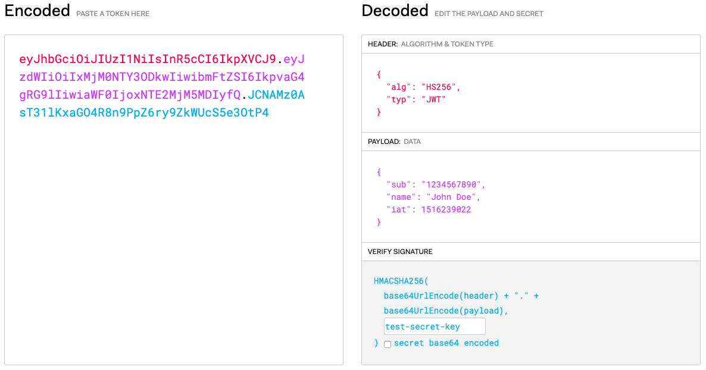

## 什么是JSON Web Token？
JSON Web Token（缩写JWT）是一个标准，用来创建访问服务的token，以作为客户端的身份标识。


## JSON Web Token的工作原理
- 客户端发起登录请求，将用户名密码发给`认证服务器`；
- `认证服务器`创建一个token，作为该用户的身份标识返回给客户端；
- 客户端收到认证服务器返回的JWT后，可以存储在Cookie里面，也可以存储在localStorage；
- 在接下来的所以请求中，客户端都需要带上该token身份标识，以访问受保护资源（比如一个API）；通常是在请求头添加`Authorization: Bearer <token>`。
- 这样，服务器就不需要保存任何session数据了，也就是说，服务器变成`无状态`，从而更容易实现扩展。


## JSON Web Token的使用场景
- **认证**：这是JWT最常见的使用场景。用户登录后，接下来的请求都需要包含JWT，以访问该token可以访问的内容（路由、服务、资源等）。SSO单点登录就是广泛使用JWT的例子。
- **信息交换**：JWT是安全传输信息的一种好的方式，因为你可以对JWT进行签名（比如，使用公私钥对），因此可以验证信息的真伪、是否被篡改。有效使用JWT，可以`降低服务器查询数据库的次数`。


## JSON Web Token的结构
JWT由三部分组成，以`.`分隔，这三部分分别都会通过`Base64Url`进行加密：

1. Header
2. Payload
3. Signature

所以，JWT长这样：`Header.Payload.Signature`。

### Header头部
JWT的头部包含两部分：

1. token的类型，即JWT；
2. 使用的签名算法，比如HMAC SHA256或者RSA。

```json
{
  "alg": "HS256",
  "typ": "JWT"
}
```

### Payload
Payload部分也是一个JSON对象，用来存放实际需要传递的数据。JWT规定了7个官方字段，供选用。
- iss(issuer)：签发人
- exp(expiration time)：过期时间
- sub(subject)：主题
- aud(audience)：受众
- nbf(Not Before)：生效时间
- iat(Issued At)：签发时间
- jti(JWT ID)：编号

除了官方字段，你还可以在这个部分定义私有字段，比如：
```json
{
  "sub": "1234567890",
  "name": "John Doe",
  "admin": true
}
```

**注意：JWT尽管可以防止篡改，但任何人都可以读取，所以不要将秘密信息放入JWT的Payload或Header中。**

### Signature
Signature部分是对前两部分的签名，防止数据篡改。

需要指定一个密钥（secret）。这个密钥只有服务器才知道，不能泄露给用户。然后，使用Header里面指定的签名算法（默认是HMAC SHA256），按照下面的公式产生签名。
```javascript
HMACSHA256(
  base64UrlEncode(header) + "." +
  base64UrlEncode(payload),
  secret)
```

生成以后大概长这样：


### Base64URL
上面提到，Header和Payload串型化的算法是Base64URL。这个算法跟Base64算法基本类似，但有一些小的不同。

JWT作为一个令牌（token），有些场合可能会放到URL（比如api.example.com/?token=xxx）。Base64有三个字符+、/和=，在URL里面有特殊含义，所以要被替换掉：=被省略、+替换成-，/替换成_。这就是Base64URL算法。


## JSON Web Token的特点
- JWT默认是不加密，但也是可以加密的。生成原始Token以后，可以用密钥再加密一次。
- JWT不加密的情况下，不能将秘密数据写入JWT。
- JWT的最大缺点是，由于服务器不保存session状态，因此无法在使用过程中废止某个token，或者更改token的权限。也就是说，`一旦JWT签发了，在到期之前就会始终有效，除非服务器部署额外的逻辑`。
- JWT本身包含了认证信息，任何人都可以获得该令牌的所有权限。为了减少盗用，JWT的有效期应该设置得比较短。对于一些比较重要的权限，使用时应该再次对用户进行认证。
- 为了减少盗用，JWT不应该使用HTTP协议明码传输，要使用HTTPS协议传输。


## JSON Web Token在Node中的使用
### 生成Header
```javascript
const header = {
  alg: 'HS256',
  typ: 'JWT'
}
const encodedHeader = Buffer.from(JSON.stringify(header)).toString('base64')
```

### 生成Payload
```javascript
const payload = {
  username: 'Jack'
}
const encodedPayload = Buffer.from(JSON.stringify(payload)).toString('base64')
```

### 生成Signature
```javascript
const crypto = require('crypto')
const jwtSecret = 'secretKey'
const signature = crypto
  .createHmac('sha256', jwtSecret)
  .update(encodedHeader + '.' + encodedPayload)
  .digest('base64')
```

### 组成JWT
```javascript
const jwt = `${encodedHeader}.${encodedPayload}.${signature}`
```

### 使用npm包jsonwebtoken
```javascript
// 生成token
var jwt = require('jsonwebtoken')
var token = jwt.sign({ foo: 'bar' }, 'secret-key', { expiresIn: '1h' })

// 验证token
var decoded = jwt.verify(token, 'secret-key')
console.log(decoded.foo)  // bar
```

更多详细用法请参考：[jsonwebtoken npm仓库](https://www.npmjs.com/package/jsonwebtoken)
