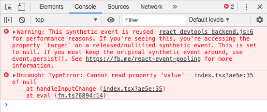

## 原本代码：报错。


debounce：
```javascript
export const debounce = (fn: Function, interval: number, immediate?: boolean) => {
  let timer: NodeJS.Timeout | null = null

  return function (...args: any[]) {
    const ctx = this

    if (timer) {
      clearTimeout(timer)
    }

    timer = setTimeout(() => {
      fn.apply(ctx, args)
    }, interval)
  }
}
```

```javascript
import React, { useState } from 'react'

const Search = () => {
  const [keyword, setKeyword] = useState('')

  const handleInputChange = (event: React.ChangeEvent<HTMLInputElement>) => {
    const value = event.target.value
    setKeyword(value)
    // Do some fetching
  }

  const debounceInputChange = debounce(handleInputChange, 1000)

  return (
    <input
      value={keyword}
      onChange={debounceInputChange}
    />
  )
}
```

## 修改后的代码
```javascript
import React, { useState } from 'react'

const Search = () => {
  const [keyword, setKeyword] = useState('')

  const handleInputChange = (value: string) => {
    // Do some fetching
  }

  // 注意：这里要使用useMemo，保证每次执行都是同一个debounceInputChange；否则，每次都会新生成一个函数。
  const debounceInputChange = useMemo(() => debounce(handleInputChange, 1000), [])

  return (
    <input
      value={keyword}
      onChange={({ target: { value } }) => {
        setKeyword(value)           // 在此处修改value
        debounceInputChange(value)
      }}
    />
  )
}
```

## 参考文章
- [React SyntheticEvent reuse](https://medium.com/trabe/react-syntheticevent-reuse-889cd52981b6)
- [SyntheticEvent](https://reactjs.org/docs/events.html#event-pooling)
- [Debouncing events with React](https://medium.com/@anuhosad/debouncing-events-with-react-b8c405c33273)
- [Fixing React Warning: Synthetic Events in setState()](https://duncanleung.com/fixing-react-warning-synthetic-events-in-setstate/)
- [setState的一个Synthetic Event Warning](https://segmentfault.com/a/1190000012181781)
