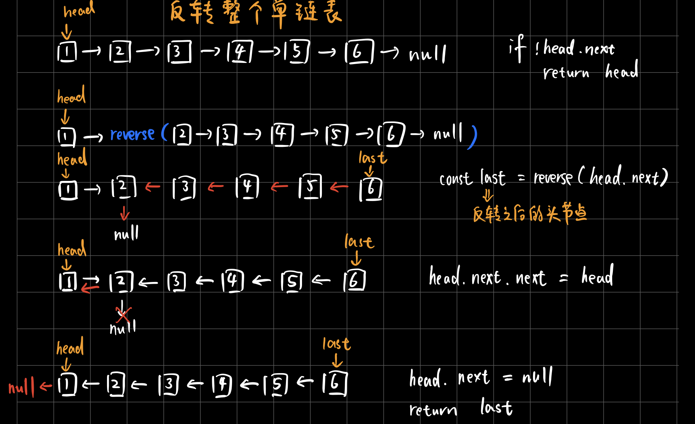
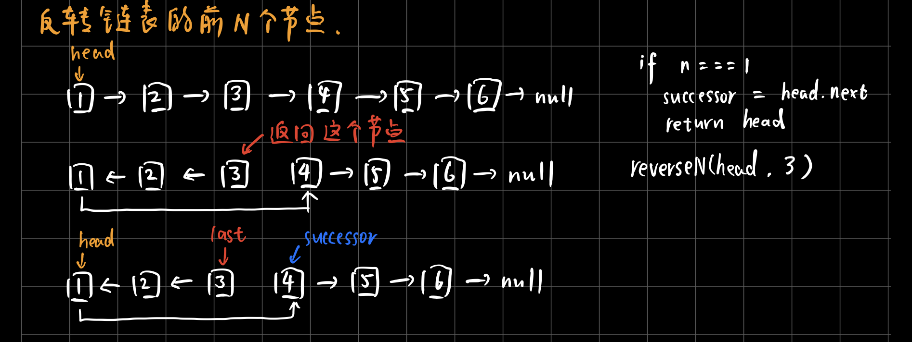
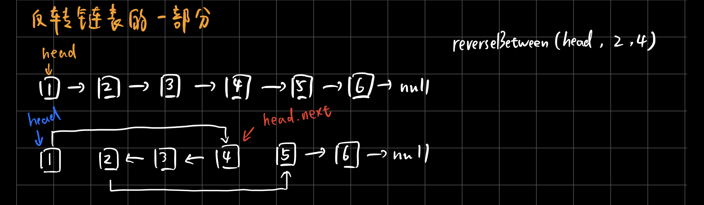

## 特殊数据结构--单调栈
单调栈实际上就是栈，只是利用了一些巧妙的逻辑，使得每次新元素入栈后，栈内的元素都保持有序（单调递增或单调递减）。

单调栈用途不太广泛，只处理一种典型的问题，叫做Next Greater Element。这里是`单调递增栈`。

### 例子1
比如：给你一个数组，返回一个等长的数组，对应索引存储着下一个更大元素，如果没有更大的元素，就存-1。给你一个数组`[2, 1, 2, 4, 3]`，你返回数组`[4, 2, 4, -1, -1]`。
```javascript
const nextGreaterElement = function(nums) {
  const len = nums.length
  const ans = new Array(len)
  const stack = []

  for (let i = len - 1; i >= 0; i--) {  // 倒着往栈里放
    while (stack.length && stack[stack.length - 1] <= nums[i]) { // 判断个子高矮
      stack.pop() // 弹出矮的
    }
    ans[i] = !stack.length ? -1 : stack[stack.length - 1] // 这个元素身后的第一个高个
    stack.push(nums[i])
  }

  return ans
}
```

### 例子2
给你一个数组T = [73, 74, 75, 71, 69, 72, 76, 73]，这个数组存放的是近几天的天气气温。你返回一个数组，计算：对于每一天，你还要至少等多少天才能等到一个更暖和的气温；如果等不到那一天，填0。

T = [73, 74, 75, 71, 69, 72, 76, 73]，返回[1, 1, 4, 2, 1, 1, 0, 0]。
```javascript
const dailyTemperatures = function(T) {
  const len = T.length
  const ans = new Array(len)
  const stack = []  // 这里放元素索引，而不是元素

  for (let i = len - 1; i >= 0; i--) {
    while (stack.length && T[stack[stack.length - 1]] <= T[i]) {
      stack.pop()
    }
    ans[i] = !stack.length ? 0 : stack[stack.length - 1] - i // 得到索引间距
    stack.push(i)  // 加入索引，而不是元素
  }

  return ans
}
```

### 如何处理「循环数组」
给你一个数组`[2, 1, 2, 4, 3]`，返回数组`[4, 2, 4, -1, 4]`。
```javascript
const nextGreaterElement = function(nums) {
  const len = nums.length
  const ans = new Array(len)
  const stack = []

  for (let i = 2 * len - 1; i >= 0; i--) {
    while (stack.length && stack[stack.length - 1] <= nums[i % len]) {
      stack.pop()
    }
    ans[i % len] = !stack.length ? -1 : stack[stack.length - 1]
    stack.push(nums[i % len])
  }

  return ans
}
```


## 特殊数据结构--单调队列
单调队列就是一个「队列」，只是使用了一点巧妙的方法，使得队列中的元素单调递增（或递减）。这个数据结构有什么用？`可以解决滑动窗口的一系列问题`。这里是`单调递减队列`。

比如：[滑动窗口最大值](https://leetcode-cn.com/problems/sliding-window-maximum/)
```javascript
// 双端队列，这些操作的复杂度都是O(1)，使用链表作为底层数据结构
class deque {
  // 在队头插入元素 n
  push_front(n) {}
  // 在队尾插入元素 n
  push_back(n) {}
  // 在队头删除元素
  pop_front() {}
  // 在队尾删除元素
  pop_back() {}
  // 返回队头元素
  front() {}
  // 返回队尾元素
  back() {}
}

// 「单调队列」的核心思路和「单调栈」类似。单调队列的push方法依然在队尾添加元素，但是要把前面比新元素小的元素都删掉。
// 最终单调队列中的元素大小就会保持一个单调递减的顺序。
class MonotonicQueue {
  constructor() {
    this.data = new deque()
  }
  push(n) {
    while (!this.data.empty() && this.data.back() < n) {
      this.data.pop_back()
    }
    this.data.push_back(n)
  }
  max() {
    return this.data.front()
  }
  pop(n) {
    // 之所以要判断this.data.front() === n，是因为我们想删除的队头元素n可能已经被「压扁」了，这时候就不用删除了
    if (!this.data.empty() && this.data.front() === n) {
      this.data.pop_front()
    }
  }
}

const maxSlidingWindow = function(nums, k) {
  const window = new MonotonicQueue()
  const res = []
  for (let i = 0; i < nums.length; i++) {
    if (i < k - 1) { // 先填满窗口的前 k - 1
      window.push(nums[i])
    } else { // 窗口向前滑动
      window.push(nums[i])
      res.push(window.max())
      window.pop(nums[i - k + 1])
    }
  }
  return res
}
```

### 单调队列和优先级队列的区别
- 单调队列在添加元素的时候靠删除元素保持队列的单调性，相当于抽取出某个函数中单调递增（或递减）的部分；
- 而优先级队列（二叉堆）相当于自动排序，两者差别很大。


## 递归反转链表
- `对于递归算法，最重要的就是明确递归函数的定义。`
- 递归的思想相对迭代思想，稍微有点难以理解，处理的技巧是：`不要跳进递归，而是利用明确的定义来实现算法逻辑`。
- 处理看起来比较困难的问题，可以尝试化整为零，把一些简单的解法进行修改，解决困难的问题。

### 递归反转整个链表
以下reverse递归函数的定义为：`输入一个节点head，将「以head为起点」的链表反转，并返回反转之后的头结点`。

```javascript
function reverse(head) {
  if (!head.next) return head
  const last = reverse(head.next)
  head.next.next = head
  head.next = null
  return last
}
```

### 递归反转链表前N个节点

```javascript
let successor = null  // 后驱节点
// 反转以head为起点的n个节点，返回新的头结点
function reverseN(head, n) {
  // base case变为n === 1，反转一个元素，就是它本身，同时要记录后驱节点。
  if (n === 1) { 
    // 记录第 n + 1 个节点
    successor = head.next
    return head
  }

  // 以head.next为起点，需要反转前n - 1个节点
  const last = reverseN(head.next, n - 1)

  head.next.next = head
  // 让反转之后的head节点和后面的节点连起来
  head.next = successor
  return last
}
```

### 递归反转链表的一部分

```javascript
function reverseBetween(head, m, n) {
  // base case
  if (m === 1) {
    return reverseN(head, n)
  }
  // 前进到反转的起点触发base case
  // 因为相当于把head.next当做头节点，此时，m，n都需要减1
  head.next = reverseBetween(head.next, m - 1, n - 1)
  return head
}
```
