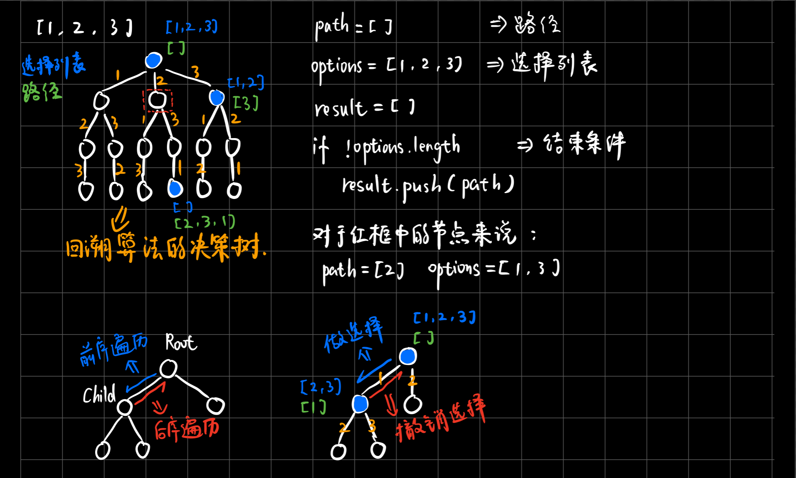
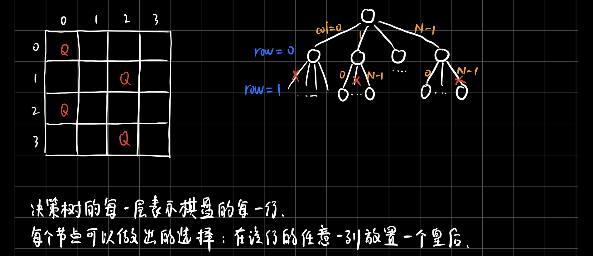
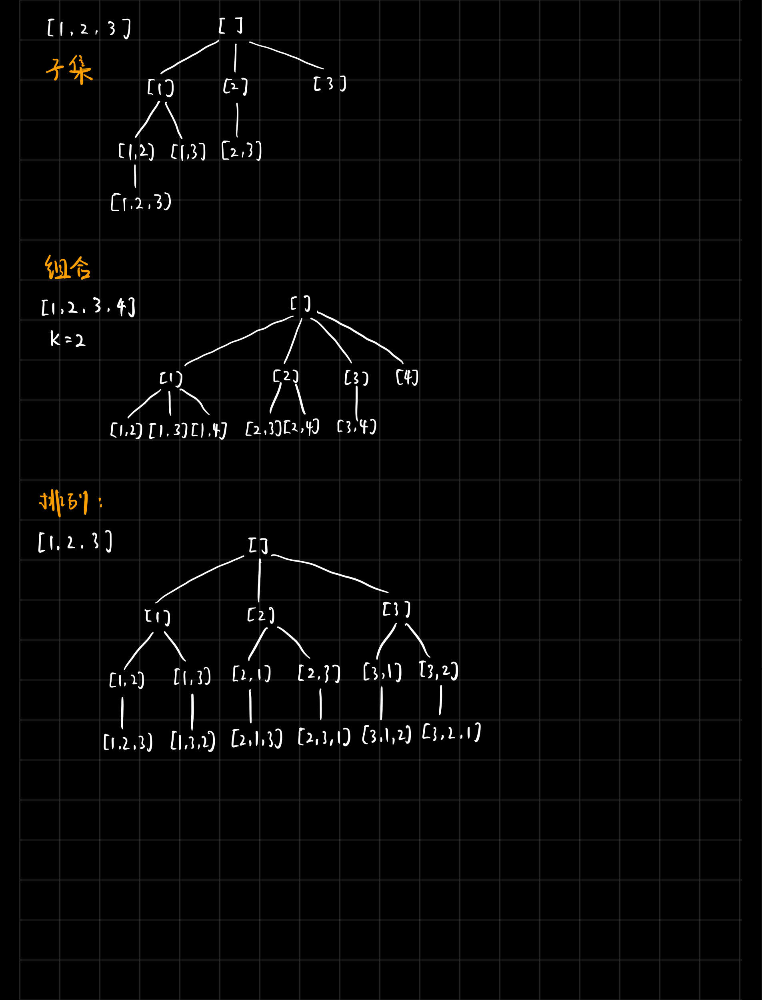

## 回溯算法解题套路框架
- `回溯算法就是个多叉树的遍历问题`，关键就是在前序遍历和后序遍历的位置做一些操作。
- **写backtrack函数时，需要维护走过的「路径」和当前可以做的「选择列表」，当触发「结束条件」时，将「路径」记入结果集。**
- 某种程度上说，动态规划的暴力求解阶段就是回溯算法。只是有的问题具有重叠子问题性质，可以用dp table或者备忘录优化，将递归树大幅剪枝，这就变成了动态规划。而本文的算法问题，都没有重叠子问题，也就是回溯算法问题了，复杂度非常高是不可避免的。**不像动态规划存在重叠子问题可以优化，回溯算法就是纯暴力穷举，复杂度一般都很高。**

`解决一个回溯问题，实际上就是一个决策树的遍历过程。`你只需要思考3个问题：

1. 路径：也就是已经做出的选择。
2. 选择列表：也就是你当前可以做的选择。
3. 结束条件：也就是到达决策树底层，无法再做选择的条件。


## 回溯算法的代码框架
`代码的核心就是for循环里面的递归，在递归调用之前「做选择」，在递归调用之后「撤销选择」。`
```javascript
const result = []
function backtrack(路径, 选择列表) {
  if (满足条件) {
    result.add(路径)
    return
  }

  for (选择 in 选择列表) {
    做选择
    backtrack(路径, 选择列表)
    撤销选择
  }
}
```


## 全排列问题

- **backtrack函数其实就像一个指针，在这棵树上游走，同时要正确维护每个节点的属性，每当走到树的底层，其「路径」就是一个全排列。**
- **前序遍历的代码在进入某一个节点之前的那个时间点执行，后序遍历代码在离开某个节点之后的那个时间点执行。**`「路径」和「选择」是每个节点的属性，函数在树上游走要正确维护节点的属性，那么就要在这两个特殊时间点搞点动作。`我们只要**在递归之前做出选择，在递归之后撤销刚才的选择**，就能正确得到每个节点的选择列表和路径。
- 排列问题是回溯思想，也可以表示成树结构套用算法模板，`关键点在于使用includes方法排除已经选择的数字`。
```javascript
/*
for 选择 in 选择列表:
  # 做选择
  将该选择从选择列表移除
  路径.add(选择)
  backtrack(路径, 选择列表)
  # 撤销选择
  路径.remove(选择)
  将该选择再加入选择列表
*/
var permute = function(nums) {
  const result = []
  backtrack(nums, [], result)
  return result
}
// 路径：记录在track中
// 选择列表：nums中不存在于track的那些元素。这里没有显式记录「选择列表」，而是通过nums和track推导出当前的选择列表
// 结束条件：nums中的元素全都在track中出现
var backtrack = function(nums, track, result) {
  if (track.length === nums.length) {
    result.push([...track])
    return
  }

  for (let i = 0; i < nums.length; i++) {
    // 排除不合法的选择
    if (track.includes(nums[i])) continue
    // 做选择
    track.push(nums[i])
    // 进入下一层决策树
    backtrack(nums, track, result)
    // 取消选择
    track.pop()
  }
}
```


## N皇后问题

- 这个问题本质上跟全排列问题差不多，决策树的每一层表示棋盘上的每一行；
- 每个节点可以做出的选择是，在该行的任意一列放置一个皇后。
- 函数backtrack依然像个在决策树上游走的指针，通过row和col就可以表示函数遍历到的位置，通过isValid函数可以将不符合条件的情况剪枝。

### 代码
```javascript
vector<vector<string>> res;

/* 输入棋盘边长 n，返回所有合法的放置 */
vector<vector<string>> solveNQueens(int n) {
  // '.' 表示空，'Q' 表示皇后，初始化空棋盘。
  vector<string> board(n, string(n, '.'));
  backtrack(board, 0);
  return res;
}

// 路径：board 中小于 row 的那些行都已经成功放置了皇后
// 选择列表：第 row 行的所有列都是放置皇后的选择
// 结束条件：row 超过 board 的最后一行
void backtrack(vector<string>& board, int row) {
  // 触发结束条件
  if (row == board.size()) {
    res.push_back(board);
    return;
  }

  int n = board[row].size();
  for (int col = 0; col < n; col++) {
    // 排除不合法选择
    if (!isValid(board, row, col)) 
      continue;
    // 做选择
    board[row][col] = 'Q';
    // 进入下一行决策
    backtrack(board, row + 1);
    // 撤销选择
    board[row][col] = '.';
  }
}

/* 是否可以在 board[row][col] 放置皇后？ */
bool isValid(vector<string>& board, int row, int col) {
  int n = board.size();
  // 检查列是否有皇后互相冲突
  for (int i = 0; i < n; i++) {
    if (board[i][col] == 'Q')
      return false;
  }
  // 检查右上方是否有皇后互相冲突
  for (int i = row - 1, j = col + 1; i >= 0 && j < n; i--, j++) {
    if (board[i][j] == 'Q')
      return false;
  }
  // 检查左上方是否有皇后互相冲突
  for (int i = row - 1, j = col - 1; i >= 0 && j >= 0; i--, j--) {
    if (board[i][j] == 'Q')
      return false;
  }
  return true;
}
```

### 若只需返回一种解法，怎么改？
**有的时候，我们并不想得到所有合法的答案，只想要一个答案，怎么办呢？**比如解数独的算法，找所有解法复杂度太高，只要找到一种解法就可以。
```javascript
// 函数找到一个答案后就返回 true
bool backtrack(vector<string>& board, int row) {
  // 触发结束条件
  if (row == board.size()) {
    res.push_back(board);
    return true;
  }
  ...
  for (int col = 0; col < n; col++) {
    ...
    board[row][col] = 'Q';

    if (backtrack(board, row + 1))
      return true;

    board[row][col] = '.';
  }

  return false;
}
```


## 子集
- leetcode: [子集](https://leetcode-cn.com/problems/subsets/)
- 子集问题可以利用数学归纳思想，假设已知一个规模较小的问题的结果，思考如何推导出原问题的结果。也可以用`回溯算法，要用start参数排除已选择的数字`。
```javascript
var subsets = function(nums) {
  const result = []
  backtrack(nums, 0, [], result)
  return result
}

var backtrack = function(nums, start, track, result) {
  // 对result更新的位置处在前序遍历，也就是说，result就是树上的所有节点
  result.push([...track])
  for (let i = start; i < nums.length; i++) {
    // 做选择
    track.push(nums[i])
    // 回溯
    backtrack(nums, i + 1, track, result)
    // 取消选择
    track.pop()
  }
}
```


## 组合
- leetcode: [组合](https://leetcode-cn.com/problems/combinations/)
- 组合问题利用的是回溯思想，结果可以表示成树结构，我们只要套用回溯算法模板即可，`关键点在于要用一个start排除已经选择过的数字`。
```javascript
var combine = function(n, k) {
  const result = []
  backtrack(n, k, 1, [], result)
  return result
}

var backtrack = function(n, k, start, track, result) {
  // 到达树的底部
  if (track.length === k) {
    result.push([...track])
    return
  }

  // 注意 i 从 start 开始递增
  for (let i = start; i <= n; i++) {
    // 做选择
    track.push(i)
    backtrack(n, k, i + 1, track, result)
    // 撤销选择
    track.pop()
  }
}
```


## 排列和组合的对比
- 根据排列问题和组合问题画出的树来看，排列问题的树比较对称，而组合问题的树越靠右节点越少。
- 在代码中的体现就是，排列问题每次通过includes方法来排除在track中已经选择过的数字；而组合问题通过传入一个start参数，来排除start索引之前的数字。
- `大部分回溯算法问题，无非就是start或者includes剪枝，也没啥别的技巧了。`


