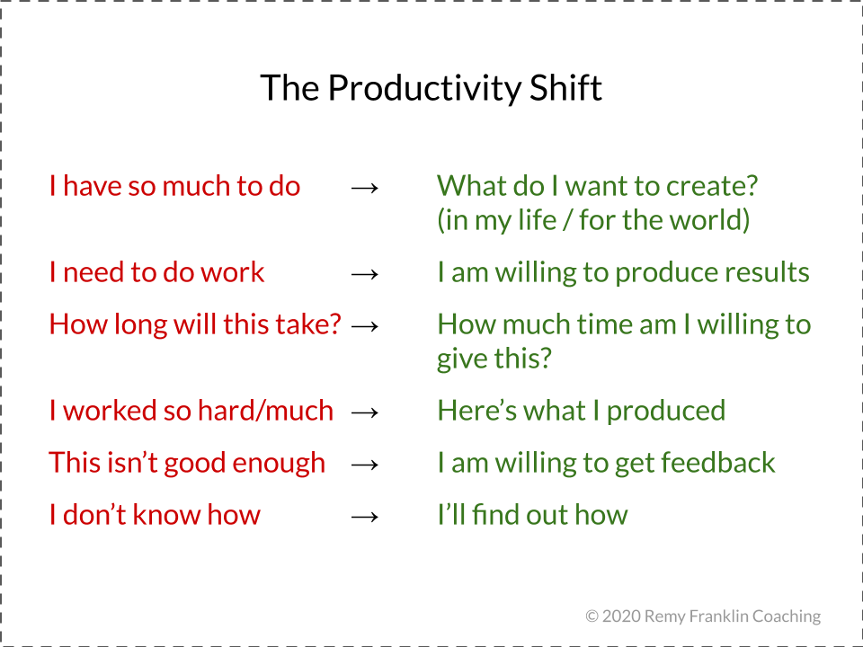

### Review

遇到困难，学会转变思维，自我娱乐，问题渐渐会迎刃而解。

### 文章阅读
- [How to Think More Productively: A Cheat Sheet](https://forge.medium.com/are-you-thinking-productive-thoughts-fd5b1d8dc885)
- [Learn the fundamentals of a good developer mindset in 15 minutes](https://www.freecodecamp.org/news/learn-the-fundamentals-of-a-good-developer-mindset-in-15-minutes-81321ab8a682/)

**How to Think More Productively: A Cheat Sheet**

很多人一直焦虑寻找好的自我管理的方式，But if you’re struggling to be productive, overhauling your process won’t help you much。

要想可持续地高效工作，首先必须学会管理你的思维。**Productivity isn’t about working “hard” or about crossing tasks off your list. Productivity is about creating results.** 高效是要创造结果的。

- 好多事情要做啊 => **我想要为我自己/世界创造什么?**
- 我需要工作 => **我愿意创造结果**
- 这需要花多长时间? => **我愿意为它付出多少时间?**
- 我工作得好努力啊，做了好多事情啊 => **看，这些都是我所创造的**
- 这还不够好 => **我愿意接收反馈**，别害怕，尽早接收反馈，不断改进
- 我不知道怎么做 => **我会找出解决办法的**
