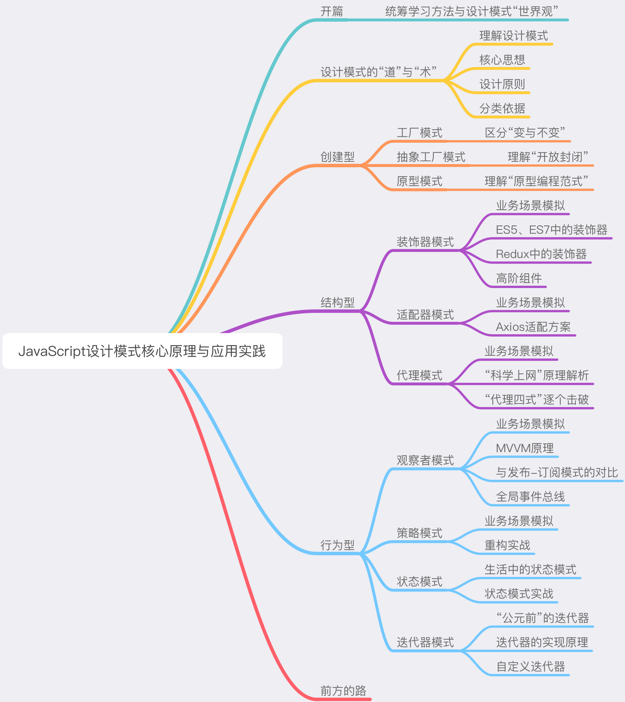

> 在软件工程中，设计模式（design pattern）是对软件设计中普遍存在（反复出现）的各种问题，所提出的解决方案。 ——维基百科P

烹饪有菜谱，游戏有攻略，每个领域都存在一些能够让我们又好又快地达成目标的“套路”。`在程序世界，编程的“套路”就是设计模式`。

授人以鱼，不如授人以渔。在尝试学习一门知识之前，最重要的事情是搞清楚**这块知识本身的意义（为什么要学？）、作用（学了它能干嘛？）和特性（怎么学比较好？），从而建立起自己的全局观**——这个过程和知识本身同样重要。

## 以不变应万变

能够决定一个前端工程师的本质的，不是那些瞬息万变的技术点，而是那些不变的东西。

所谓“不变的东西”，说的就是驾驭技术的能力。具体来说，它分为以下三个层次：
- **能用健壮的代码去解决具体的问题；**（这个能力在软件工程领域所对标的经典知识体系，恰恰就是设计模式。）
- **能用抽象的思维去应对复杂的系统；**
- **能用工程化的思想去规划更大规模的业务。**

## 前端工程师，首先是软件工程师
> 基础理论知识是一个人的基线，理论越强基线越高。再为自己定一个目标和向上攀附的阶梯，那么达到目标就是时间问题，而很多野路子工程师搞了半辈子也未达到优秀工程师的基线，很多他们绞尽脑汁得出的高深学问，不过是正规工程师看起来很自然的东西。—— 吴军

很多人缺乏的并不是这种高瞻远瞩的激情，而是我们前面提到的“不变能力”中最基本的那一点——用健壮的代码去解决具体的问题的能力。

所以说，想做靠谱开发，先掌握设计模式。

## 设计模式的学习之道

设计模式的“难”，在于其令人望而生畏的`抽象性`和知识点的`分散性`。

其实设计模式并不高大上，它是一个非常接地气、非常实际的东西——因为它本身就是一帮非常苦逼的程序员在自己的职业生涯里实打实地踩坑踩出来的。解决知识抽象性带来的理解障碍，重要的不是反复的陈述、解释，而是**把自己放到一个正确的场景里，去体会这个模式的好**。

所谓“分散性”其实也是纸老虎——深入了解设计模式后，大家会发现模式与模式间存在着不可忽略的共性与关联——设计原则与核心的设计思想。

**不同的设计模式并非是一座座的孤岛，他们之间彼此呼应、相互成就，共同构建起了一套完整而经典的软件思想体系。**

## 设计模式之道
> 每一个模式描述了一个在我们周围不断重复发生的问题，以及该问题的解决方案的核心。这样，你就能一次又一次地使用该方案而不必做重复劳动。 —— Christopher Alexander

### SOLID设计原则
设计原则是设计模式的指导理论，它可以帮助我们规避不良的软件设计。SOLID指代的五个基本原则分别是：
- 单一职责原则（Single Responsibility Principle）
- 开放封闭原则（Opened Closed Principle）
- 里式替换原则（Liskov Substitution Principle）
- 接口隔离原则（Interface Segregation Principle）
- 依赖反转原则（Dependency Inversion Principle）

### 设计模式的核心思想——封装变化
设计模式出现的背景，是软件设计的复杂度日益飙升。软件设计越来越复杂的“罪魁祸首”，就是`变化`。

在实际开发中，不发生变化的代码可以说是不存在的。我们能做的只有将这个变化造成的影响**最小化——将变与不变分离，确保变化的部分灵活、不变的部分稳定**。这个过程，就叫“封装变化”。

## 设计模式的“术”
所谓“术”，其实就是指二十年前GOF提出的最经典的23种设计模式。

设计模式的核心思想，就是“封装变化”。确实如此，无论是创建型、结构型还是行为型，这些具体的设计模式都是在用自己的方式去封装不同类型的变化。
- **创建型模式封装了`创建对象过程中的变化`**，比如工厂模式，它做的事情就是将创建对象的过程抽离；
- **结构型模式封装的是`对象之间组合方式的变化`，目的在于灵活地表达对象间的配合与依赖关系**；
- 而**行为型模式则`将是对象千变万化的行为进行抽离`，确保我们能够更安全、更方便地对行为进行更改**。

封装变化，封装的正是软件中那些不稳定的要素，它是一种防患于未然的行为——提前抽离了变化，就为后续的拓展提供了无限的可能性，如此，我们才能做到在变化到来的时候从容不迫。
